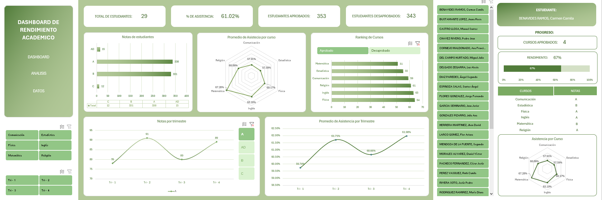
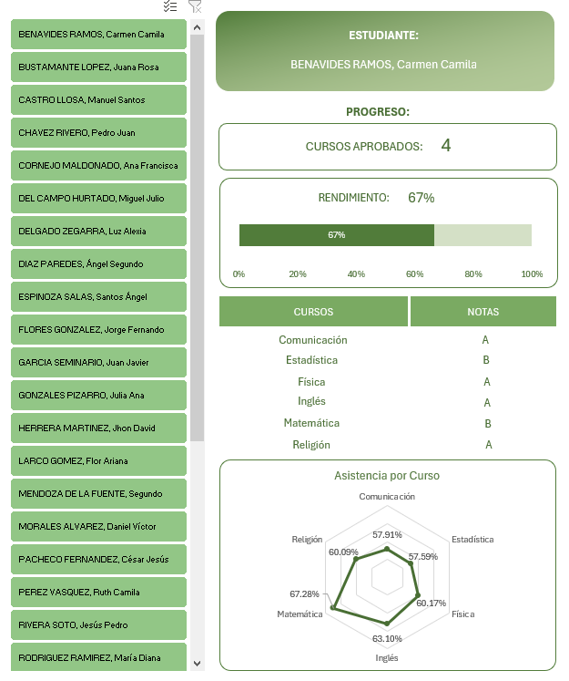

# Dashboard de Rendimiento Académico - Seguimiento de Estudiantes por Curso y Trimestre

## Descripción General

Este repositorio contiene un **dashboard interactivo en Excel** para el seguimiento y análisis del rendimiento académico de estudiantes. La herramienta permite visualizar métricas clave como total de estudiantes, porcentaje de asistencia, estudiantes aprobados y desaprobados, distribución de notas por curso y trimestre, y ranking de cursos con mejor y peor desempeño.

## Características Principales

- **Métricas Generales:**
  - Total de Estudiantes
  - % de Asistencia Promedio
  - Estudiantes Aprobados
  - Estudiantes Desaprobados: 

- **Notas:**
  - AD (Logro destacado)
  - A (Logro esperado)
  - B (En proceso)
  - C (En inicio)

- **Análisis por Curso:**
  - Promedio de asistencia por curso
  - Cursos con más aprobados y desaprobados
  - Rendimiento por curso 

- **Análisis por Trimestre:**
  - Notas por trimestre 
  - Promedio de asistencia por trimestre

- **Listado de Estudiantes:** Relación completa de todos los estudiantes con su desempeño por curso.

## Objetivo del Proyecto
Crear una herramienta de **seguimiento académico** que permita a docentes, coordinadores y directivos visualizar rápidamente el rendimiento de los estudiantes, identificar cursos con dificultades, monitorear la asistencia y tomar decisiones para mejorar los resultados educativos.

## Objetivos del Proyecto
- **Consolidar información académica:** Integrar datos de estudiantes, cursos, notas por trimestre y asistencia en un solo lugar.
- **Visualizar métricas clave:** Mostrar de forma clara el panorama general del rendimiento estudiantil.
- **Identificar áreas de mejora:** Detectar cursos con mayor número de desaprobados o baja asistencia.
- **Facilitar el seguimiento individual:** Tener un listado completo de estudiantes para consultas rápidas.

## Insights Clave para el Negocio
- **Casi la mitad de los estudiantes están en "B" (En proceso):** El 47.56% de las notas registradas son B, lo que indica que una gran parte de los estudiantes está cerca del nivel esperado pero necesita apoyo adicional para alcanzarlo.
- **Matemática tiene la mejor asistencia pero no el mejor rendimiento:** Con 67.28% de asistencia (la más alta), Matemática tiene 51 aprobados, menos que otros cursos como Física (64 aprobados) con menor asistencia. Esto sugiere que **la asistencia no siempre garantiza el rendimiento**.
- **Inglés destaca en asistencia y aprobados:** Tiene 63.10% de asistencia (segundo más alto) y 63 aprobados (segundo más alto), siendo uno de los cursos con mejor relación asistencia-rendimiento.
- **El segundo trimestre es el de mejor rendimiento:** Con 91 notas A, el Tri-2 supera a los demás trimestres. Esto puede deberse a mayor motivación, mejores estrategias pedagógicas o contenidos más accesibles.
- **Comunicación y Estadística tienen las asistencias más bajas:** Con 57.91% y 57.59% respectivamente, son los cursos con menor asistencia y también están entre los que tienen menos aprobados. Hay una **oportunidad de mejora en engagement y motivación** en estos cursos.
- **4 cursos aprobados vs 2 desaprobados:** El rendimiento general es positivo (67% de cursos aprobados), pero los cursos desaprobados (posiblemente Comunicación y Estadística) requieren atención especial.

## Pasos Involucrados
1. **Recopilar y organizar los datos:** Se consolidó la información de estudiantes por período, curso, notas (1-4), trabajos, promedio final, estado (aprobado/desaprobado) y porcentaje de asistencia.
2. **Calcular métricas clave:** Se obtuvieron totales, promedios y distribuciones usando tablas dinámicas y fórmulas en Excel.
3. **Crear visualizaciones:** Se diseñaron tablas y gráficos para mostrar:
   - Resumen general (estudiantes, asistencia, aprobados/desaprobados)
   - Distribución de notas por letra (AD, A, B, C)
   - Promedio de asistencia por curso y trimestre
   - Ranking de cursos con más aprobados y desaprobados
   - Listado completo de estudiantes
4. **Validar la información:** Se revisó que los datos fueran consistentes y reflejaran la realidad académica.

## Habilidades Demostradas
- **Análisis de datos educativos:** Interpretación de métricas de rendimiento y asistencia para tomar decisiones pedagógicas.
- **Manejo de Excel:** Tablas dinámicas, fórmulas de conteo y promedio, formato condicional.
- **Visualización de información:** Diseño claro de tablas y gráficos para facilitar la lectura de datos académicos.
- **Seguimiento académico:** Capacidad para monitorear el progreso de estudiantes y cursos a lo largo del tiempo.

## Funciones y Técnicas Utilizadas
- **Tablas dinámicas:** Para resumir estudiantes por nota, curso, trimestre y estado (aprobado/desaprobado).
- **Fórmulas de conteo y promedio:** `CONTAR`, `CONTAR.SI`, `PROMEDIO`, `PROMEDIO.SI` para calcular métricas clave.
- **Formato condicional:** Para resaltar visualmente los valores más altos y más bajos en asistencias y notas.
- **Segmentación de datos:** Organización de la información por trimestre, curso y estado para análisis específicos.
- **Escala de notas:** Conversión de notas numéricas a letras (AD, A, B, C) según el rendimiento.

## Conclusión
Este dashboard académico permite a instituciones educativas tener una visión clara y rápida del rendimiento de sus estudiantes. Con métricas de aprobación, asistencia y distribución de notas por curso y trimestre, los docentes y directivos pueden identificar oportunidades de mejora, enfocar recursos en los cursos con más dificultades y hacer seguimiento personalizado a cada estudiante.
